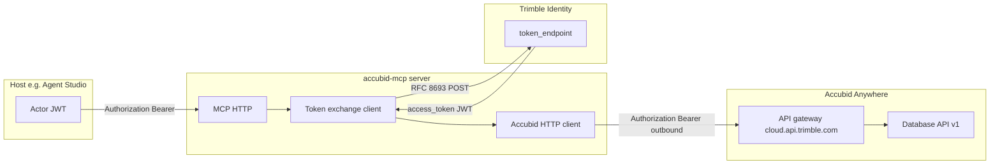
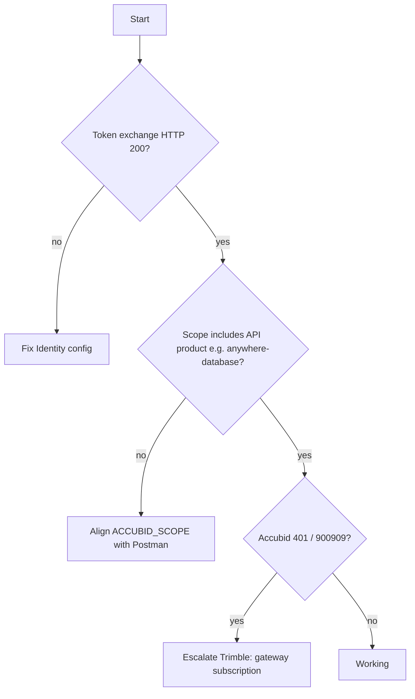

# Trimble / Accubid Anywhere: MCP On-Behalf-Of Authentication — Support & Escalation Package

**Document purpose:** Provide a single, exhaustive reference for **Trimble Accubid**, **Trimble Identity**, **Developer Console**, and **partner engineering** teams when diagnosing why an **RFC 8693 token-exchange** access token is **accepted by Identity** but **rejected by the Accubid Anywhere REST gateway** (fault **900909**), while an **authorization-code** token for the **same `client_id`** succeeds against the same route.

**Audience:** Product owners, API support, Identity engineers, Accubid gateway engineers, and security reviewers. **No Python knowledge is required** to use this document; implementation file paths are included only as pointers for engineers who wish to verify behavior.

**Related repository:** `accubid-mcp` (Accubid Anywhere MCP server).

**Disclaimer:** Error payloads, GUIDs, and hostnames in examples are illustrative or taken from real diagnostics **as examples**; replace with your tenant’s values when filing tickets. Never paste **live secrets** (`CLIENT_SECRET`, refresh tokens) into public channels.

---

## Table of contents

1. [Executive summary](#1-executive-summary)
2. [Problem statement in one page](#2-problem-statement-in-one-page)
3. [Glossary](#3-glossary)
4. [Why this document exists](#4-why-this-document-exists)
5. [Comparison with other Trimble stacks](#5-comparison-with-other-trimble-stacks)
6. [Solution architecture (conceptual)](#6-solution-architecture-conceptual)
7. [End-to-end request flows](#7-end-to-end-request-flows)
8. [RFC 8693 token exchange — what we send](#8-rfc-8693-token-exchange--what-we-send)
9. [What Trimble Identity explicitly rejects](#9-what-trimble-identity-explicitly-rejects)
10. [Accubid Anywhere REST URL construction](#10-accubid-anywhere-rest-url-construction)
11. [OAuth scopes vs API “products”](#11-oauth-scopes-vs-api-products)
12. [Failure modes we have observed (complete list)](#12-failure-modes-we-have-observed-complete-list)
13. [Fault 900909 — deep dive](#13-fault-900909--deep-dive)
14. [JWT claims: what to compare (Postman vs MCP)](#14-jwt-claims-what-to-compare-postman-vs-mcp)
15. [MCP structured error payload (for support)](#15-mcp-structured-error-payload-for-support)
16. [Reproduction checklists](#16-reproduction-checklists)
17. [Environment variables (reference)](#17-environment-variables-reference)
18. [Repository code map (for engineers)](#18-repository-code-map-for-engineers)
19. [Operational notes](#19-operational-notes)
20. [Security: what to share with Trimble](#20-security-what-to-share-with-trimble)
21. [Numbered questions for Trimble](#21-numbered-questions-for-trimble)
22. [Ready-to-send support ticket (template)](#22-ready-to-send-support-ticket-template)
23. [Short executive email (template)](#23-short-executive-email-template)
24. [Appendix A — Token exchange HTTP shape](#appendix-a--token-exchange-http-shape)
25. [Appendix B — Accubid fault JSON (example)](#appendix-b--accubid-fault-json-example)
26. [Appendix C — Subject token type notes](#appendix-c--subject-token-type-notes)
27. [Appendix D — Document revision notes](#appendix-d--document-revision-notes)
28. [Chronology of remediation attempts](#chronology-of-remediation-attempts)
29. [FAQ — exhaustive](#faq--exhaustive)
30. [Stakeholder routing inside Trimble](#stakeholder-routing-inside-trimble)
31. [Ticket / case fields to populate](#ticket--case-fields-to-populate)
32. [Verbatim error strings (Identity + Accubid)](#verbatim-error-strings-identity--accubid)
33. [MCP error codes reference](#mcp-error-codes-reference)
34. [Agent Studio integration notes](#agent-studio-integration-notes)
35. [Postman parity procedure (detailed)](#postman-parity-procedure-detailed)
36. [If token-exchange is not supported — architectural options](#if-token-exchange-is-not-supported--architectural-options)
37. [Meeting agenda (60 minutes) with Trimble](#meeting-agenda-60-minutes-with-trimble)
38. [Appendix E — Decision tree (text + Mermaid)](#appendix-e--decision-tree-text--mermaid)
39. [Appendix F — Extended question list for vendor](#appendix-f--extended-question-list-for-vendor)
40. [Appendix G — RFC and spec references](#appendix-g--rfc-and-spec-references)
41. [Appendix H — Risk register (project)](#appendix-h--risk-register-project)
42. [Appendix I — Sample decoded JWT shapes](#appendix-i--sample-decoded-jwt-shapes-illustrative-redacted)
43. [Appendix J — accubid-mcp capabilities affected](#appendix-j--accubid-mcp-capabilities-affected-by-database-api-auth)
44. [Appendix K — Server operations (systemd)](#appendix-k--server-operations-linux-systemd--correlating-logs)
45. [Appendix L — Internal status update template](#appendix-l--internal-status-update-template-for-your-leadership)
46. [Appendix M — Hypotheses on “subscription inactive”](#appendix-m--what-subscription-inactive-might-mean-hypotheses-only)
47. [Appendix N — Contact escalation path (your org)](#appendix-n--contact-escalation-path-your-organization)

---

## 1. Executive summary

- We operate an **MCP (Model Context Protocol) HTTP server** that calls **Accubid Anywhere** REST APIs **on behalf of** an end user represented by a **Bearer token** issued to another application (e.g. **Agent Studio**).
- To obtain an access token scoped for our **registered OAuth application**, we use **OAuth 2.0 Token Exchange (RFC 8693)** against **Trimble Identity** (`id.trimble.com`), with **`grant_type=urn:ietf:params:oauth:grant-type:token-exchange`**.
- **Token exchange succeeds (HTTP 200)**. The returned access token is a **JWT** whose claims include **`azp`** equal to our **`client_id`** and **`scope`** values including **`anywhere-database`** (when configured).
- Calls to **Accubid Anywhere** such as **`GET https://cloud.api.trimble.com/anywhere/database/v1/databases`** fail with **HTTP 401** and fault code **`900909`**, described as **“The subscription to the API is inactive.”**
- The **same OAuth application** (`client_id`) can call the **same URL successfully** using a token obtained via a **browser / authorization-code** style flow (e.g. **Postman**).
- **Trimble Identity** returns **HTTP 400** if we include optional parameters **`resource`** (RFC 8707) or **`audience`** on the token exchange request, with **`error_description`** stating that the parameter is **“explicitly rejected by this IDP.”** Therefore we **cannot** use those parameters to steer the token to a specific API resource at exchange time.
- **Conclusion for support:** The integration appears **blocked at the Accubid Anywhere API gateway / subscription layer** for **token-exchange-derived** access tokens, not at Identity issuance, not at missing REST path segments, and not at missing **`anywhere-database`** in the outbound token **when that scope is already present**. We require **product or platform guidance** on entitlement rules for **RFC 8693** vs **authorization-code** for the same `client_id`.

---

## 2. Problem statement in one page

| Layer | Expected | Observed |
|--------|-----------|----------|
| Agent Studio (or host) | Sends `Authorization: Bearer <actor JWT>` to MCP | OK |
| MCP → Trimble Identity | RFC 8693 token exchange with `CLIENT_ID`/`CLIENT_SECRET` | **HTTP 200**, `access_token` returned |
| Outbound JWT | `azp` = `CLIENT_ID`; `scope` includes `anywhere-database` | **Matches expectation** when `ACCUBID_SCOPE` is set |
| MCP → Accubid Anywhere | `Authorization: Bearer <exchanged access_token>` | **HTTP 401**, fault **900909**, “subscription inactive” |
| Postman → same URL | Bearer from auth-code flow, same `client_id` | **HTTP 200** |

**Ask:** Explain why **subscription** is **inactive** for the **token-exchange** JWT but **active** for the **authorization-code** JWT when both reference the **same client** and the REST route is unchanged.

---

## 3. Glossary

| Term | Meaning |
|------|---------|
| **MCP** | Model Context Protocol; a JSON-RPC-style protocol over HTTP (streamable HTTP) used here to expose tools to AI hosts. |
| **Actor token / inbound JWT** | Bearer token on the MCP HTTP request; identifies the **calling application context** (e.g. Agent Studio). Claim **`azp`** on this token is **not** the Accubid API OAuth client id. |
| **`CLIENT_ID` / `CLIENT_SECRET`** | Confidential OAuth application credentials registered in **Trimble Developer Console** for the MCP server. |
| **Token exchange (RFC 8693)** | OAuth grant where a client presents a **subject token** and receives a **new** access token for itself (or delegated audience, per spec). |
| **Subject token** | The actor JWT sent as `subject_token` to Identity. |
| **Outbound / exchanged token** | Access token returned by Identity after exchange; used as Bearer to **cloud.api.trimble.com**. |
| **Authorization-code flow** | Standard OAuth redirect flow; user consent; access token issued **directly** to the app. Used in Postman for comparison. |
| **900909** | Trimble/Accubid fault code returned in JSON body on **401** for this scenario; message often **Authentication Failure**; description **subscription inactive**. |
| **IdP** | Identity Provider — here **Trimble Identity** at `id.trimble.com`. |
| **Accubid Anywhere REST** | HTTP APIs under **`https://cloud.api.trimble.com/anywhere/...`** with per-module version segments (`database/v1`, `project/v2`, etc.). |

---

## 4. Why this document exists

- **Cross-team clarity:** Identity engineers may not see Accubid gateway faults; Accubid engineers may not see Identity token endpoints. This document ties both together with **repro steps** and **comparative JWT semantics**.
- **Non-code audience:** Support and PM can route the case without reading Python.
- **Persistence:** Slack threads get lost; this file is version-controlled and can be attached to Jira/ServiceNow.

---

## 5. Comparison with other Trimble stacks

The same organization has shipped **delegated / on-behalf-of** style integrations for **Trimble Connect**, **ProjectSight**, **Vista**, and others using familiar patterns (token exchange or equivalent service tokens + Trimble Identity). Those paths did **not** exhibit:

- Successful Identity issuance followed by **consistent 401 / 900909** on the **first REST call** with correct product scopes on the outbound token.

That observation **does not prove** Accubid is “wrong”; it suggests **Accubid Anywhere’s API gateway** may enforce **subscription or product linkage** differently, or may require **allowlisting** or **console flags** specific to **token-exchange** for REST data planes. **Only Trimble can confirm.**

---

## 6. Solution architecture (conceptual)



**Key point:** Two different OAuth clients appear in diagnostics:

1. **Actor JWT `azp`** — identifies the **host** (e.g. Agent Studio app registration).
2. **Outbound JWT `azp`** — should equal **`CLIENT_ID`** for the MCP app after exchange.

Accubid’s **900909** diagnostics reference the **outbound** token’s client (`azp`), not the actor.

---

## 7. End-to-end request flows

### 7.1 Happy path (Identity perspective)

1. MCP receives HTTP request with header: `Authorization: Bearer <actor JWT>`.
2. MCP loads OpenID configuration from `OPENID_CONFIGURATION_URL` (default `https://id.trimble.com/.well-known/openid-configuration`) and reads **`token_endpoint`**.
3. MCP `POST`s to `token_endpoint` with `Content-Type: application/x-www-form-urlencoded` and **`Authorization: Basic`** using `base64(CLIENT_ID:CLIENT_SECRET)`.
4. Form body includes at minimum:
   - `grant_type=urn:ietf:params:oauth:grant-type:token-exchange`
   - `subject_token=<actor JWT>`
   - `subject_token_type=` either `urn:ietf:params:oauth:token-type:jwt` or access-token URN (implementation may retry)
   - `scope=<space-separated ACCUBID_SCOPE>`
5. Identity returns JSON with **`access_token`** (JWT) and typically **`expires_in`**.

### 7.2 Failing path (Accubid Anywhere)

1. MCP calls `GET https://cloud.api.trimble.com/anywhere/database/v1/databases` with `Authorization: Bearer <exchanged JWT>`.
2. Response **401** with body containing **`fault.code` = `900909`** and description about **inactive subscription**.

### 7.3 Comparison path (Postman)

1. User completes **authorization code** flow in Postman for the **same `CLIENT_ID`**.
2. Postman calls the **same** `GET .../database/v1/databases` with the **issued** access token.
3. Response **200** with database list.

---

## 8. RFC 8693 token exchange — what we send

The implementation intentionally sends **only** the following form fields for token exchange (plus HTTP Basic auth):

| Field | Typical value |
|-------|----------------|
| `grant_type` | `urn:ietf:params:oauth:grant-type:token-exchange` |
| `subject_token` | Actor JWT from MCP request |
| `subject_token_type` | JWT or access-token URN per RFC 8693 |
| `scope` | From `ACCUBID_SCOPE` (e.g. `openid accubid_agentic_ai anywhere-database`) |

**Source:** [`src/auth.py`](../src/auth.py) (`AccubidAuth._exchange_once`).

---

## 9. What Trimble Identity explicitly rejects

When optional parameters are added to the token exchange request:

| Parameter | Standard | Identity response |
|-----------|----------|-------------------|
| `resource` | RFC 8707 Resource Indicators | **HTTP 400**, `invalid_request`, *`'resource' parameter explicitly rejected by this IDP.* |
| `audience` | Often used with token exchange | **HTTP 400**, `invalid_request`, *`'audience' parameter explicitly rejected by this IDP.* |

**Implication:** For this IdP configuration, **audience and resource cannot be used** to fix downstream 900909. Any resolution must come from **allowed scopes**, **Developer Console product subscription**, **tenant entitlement**, or **gateway policy** — not from adding these parameters.

---

## 10. Accubid Anywhere REST URL construction

Base URL: `ACCUBID_API_BASE_URL` (default **`https://cloud.api.trimble.com/anywhere`**).

Full URL pattern:

```text
{ACCUBID_API_BASE_URL}/{area}/{version}{path}
```

Examples:

| Area | Default version | Example path | Example full URL |
|------|-----------------|--------------|------------------|
| `database` | `v1` | `/databases` | `.../anywhere/database/v1/databases` |
| `project` | `v2` | `/Folder` | `.../anywhere/project/v2/Folder` |
| `estimate` | configurable | `/Estimates/...` | `.../anywhere/estimate/v1/...` |

**Source:** [`src/config.py`](../src/config.py) (`Config.accubid_api_url`).

---

## 11. OAuth scopes vs API “products”

Documentation often lists **scope** names next to API bases, e.g.:

- **Database API** — scope **`anywhere-database`**
- **Project API** — scope **`anywhere-project`**

The MCP server uses a **single** `ACCUBID_SCOPE` string for token exchange. For tools that call multiple areas, the string should include **all** required scopes (space-separated), aligned with what a working Postman authorize URL uses.

**Important:** Including a scope in the token **does not** guarantee Accubid gateway acceptance if **subscription** or **grant-type policy** fails — that is exactly the **900909** situation under investigation.

---

## 12. Failure modes we have observed (complete list)

### 12.1 `auth_failed` — token exchange HTTP 400 — `resource` rejected

- **Symptom:** MCP returns `auth_failed`; details show Identity **400** and `error_description` about **`resource`** rejected.
- **Cause:** `ACCUBID_TOKEN_EXCHANGE_RESOURCE` was set (or parameter sent).
- **Resolution:** **Remove**; Identity does not accept it for this flow.

### 12.2 `auth_failed` — token exchange HTTP 400 — `audience` rejected

- **Symptom:** Same as above but for **`audience`**.
- **Resolution:** **Remove** `ACCUBID_TOKEN_EXCHANGE_AUDIENCE`; Identity does not accept it.

### 12.3 `api_error` — HTTP 401 — fault **900909**

- **Symptom:** Exchange **succeeds**; Accubid returns **401** with **900909** and “subscription inactive.”
- **When scope was missing `anywhere-database`:** Fixed by expanding **`ACCUBID_SCOPE`** (copy Postman `scope=`).
- **When `anywhere-database` is already on the outbound JWT:** **Not fixable** by MCP configuration alone; requires **Trimble** product/gateway guidance.

### 12.4 Other Identity errors (less common in this narrative)

- **`unsupported_grant_type` / `invalid_grant`:** Token exchange not enabled for app or wrong credentials.
- **Audience / signature errors:** Wrong OpenID metadata URL or wrong app registration.

---

## 13. Fault 900909 — deep dive

**HTTP status:** 401 Unauthorized  

**Typical body shape (conceptual):** JSON with `fault` object:

- `fault.status`: `"401"`
- `fault.code`: `"900909"`
- `fault.message`: e.g. `"Authentication Failure"`
- `fault.description`: e.g. `"The subscription to the API is inactive"`

**Interpretation for this case:**

- The server is not saying “your URL is wrong.”
- It is asserting that the **OAuth client / token** does not have an **active subscription** for that **API product** as evaluated by the **gateway**.

**Hypothesis (for Trimble to confirm):**

- Subscription checks might differ between tokens issued via **authorization-code** vs **token-exchange**, even for the same `client_id`.
- Alternatively, **token-exchange** might require a **separate** Developer Console entitlement or **tenant-level** enablement.

---

## 14. JWT claims: what to compare (Postman vs MCP)

Provide **decoded** (header + payload only) for **both** tokens.

| Claim | Postman (auth-code) | MCP (token-exchange) | Notes |
|-------|---------------------|----------------------|--------|
| `iss` | Issuer | Issuer | Should match environment |
| `sub` | Subject | Subject | May differ; not sufficient alone |
| `aud` | Audience(s) | Audience(s) | Compare arrays or strings |
| `azp` | **Should be `CLIENT_ID`** | **Should be `CLIENT_ID`** | Primary client identifier for API |
| `scope` | Space-separated | Space-separated | Must include API scopes |
| `iat` / `exp` | Times | Times | Use for correlation |

**What support should look for:**

- Same **`azp`** (MCP app) for both.
- Same **effective API scopes** for the route under test.
- Any claim present in **one** token and **absent** in the other that Accubid’s gateway maps to **subscription**.

---

## 15. MCP structured error payload (for support)

The MCP returns JSON with stable **`error.code`** values. For **`api_error`**, **`details`** often includes:

| Field | Meaning |
|-------|---------|
| `method` | HTTP method |
| `endpoint_path` | Logical path e.g. `/databases` |
| `request_url` | Full URL to Accubid |
| `response_body` | Upstream body (may truncate) |
| `status_code` | 401 |
| `actor_azp` | `azp` of **inbound** actor JWT (diagnostic) |
| `actor_sub` | `sub` of inbound JWT |
| `actor_account_id` | If present on JWT |
| `actor_scopes` | Scope on **inbound** token |
| `outbound_azp` | `azp` on **exchanged** token |
| `outbound_aud` | `aud` on exchanged token |
| `outbound_scope_claim` | `scope` on exchanged token |
| `hint` | Human-readable guidance |

Attach a **single** redacted example payload to the ticket.

---

## 16. Reproduction checklists

### 16.1 Trimble Identity — token exchange

- [ ] `CLIENT_ID` / `CLIENT_SECRET` from Developer Console (confidential client).
- [ ] Token exchange (**On-Behalf-Of**) enabled for the application.
- [ ] `ACCUBID_SCOPE` matches working Postman **`scope=`** for the APIs under test.
- [ ] `POST` token endpoint returns **200** and JWT `access_token`.
- [ ] Do **not** send `resource` or `audience` (Identity rejects for this IdP).

### 16.2 Accubid Anywhere — REST

- [ ] `GET .../anywhere/database/v1/databases` with exchanged token → observe **401/900909** (this incident).
- [ ] Same request with Postman token → **200**.

### 16.3 Account / product

- [ ] Accubid Anywhere **API Data Access** and product subscription assumptions verified per your org’s Accubid admin (see README note).
- [ ] Same **tenant/user** context when comparing Postman vs MCP (as much as practical).

---

## 17. Environment variables (reference)

**Required (typical):**

| Variable | Role |
|----------|------|
| `OPENID_CONFIGURATION_URL` | OpenID metadata (default Trimble) |
| `CLIENT_ID` | OAuth app id |
| `CLIENT_SECRET` | OAuth app secret |
| `ACCUBID_SCOPE` | Scopes requested at token exchange |
| `ACCUBID_API_BASE_URL` | `https://cloud.api.trimble.com/anywhere` |

**Do not set (Trimble Identity rejects on token exchange):**

- `ACCUBID_TOKEN_EXCHANGE_RESOURCE` — not used; caused **400** when tried.
- `ACCUBID_TOKEN_EXCHANGE_AUDIENCE` — not used; caused **400** when tried.

**Debug (short-lived):**

- `ACCUBID_DEBUG_LOG_OUTBOUND_TOKEN=true` — logs full bearer (sensitive); disable after debugging.

See [`.env.example`](../.env.example) for the full list.

---

## 18. Repository code map (for engineers)

| Concern | File |
|---------|------|
| Token exchange | [`src/auth.py`](../src/auth.py) |
| HTTP client, 900909 diagnostics | [`src/client.py`](../src/client.py) |
| URL building, env | [`src/config.py`](../src/config.py) |
| Actor Bearer extraction | [`src/request_context.py`](../src/request_context.py) |
| Tool execution wrapper | [`src/tool_runtime.py`](../src/tool_runtime.py) |
| HTTP entry, lifespan close | [`src/main.py`](../src/main.py) |
| Database tools | [`src/tools/database.py`](../src/tools/database.py) |

---

## 19. Operational notes

- **Caching:** Exchanged tokens are cached in memory keyed by hash of actor token + scope string (see [`src/auth.py`](../src/auth.py)). After changing **`ACCUBID_SCOPE`**, restart the process to avoid stale cache in long-running servers.
- **Transport:** Accubid tools require **streamable HTTP** so `Authorization` reaches the server; STDIO mode cannot pass per-request HTTP headers from Agent Studio.
- **Shutdown:** HTTP mode closes the aiohttp session via FastMCP/Starlette lifespan.

---

## 20. Security: what to share with Trimble

**Safe to share (with ticket):**

- `client_id` (public identifier)
- Redacted JWT **headers + payloads** (remove or mask PII if policy requires)
- HTTP **status codes** and **fault JSON** (no secrets)
- Exact **request URL** path
- **Timestamps** (UTC) of failures

**Never share in public forums:**

- `CLIENT_SECRET`
- Refresh tokens
- Live `Authorization` headers from production

Use Trimble-approved **secure upload** if available.

---

## 21. Numbered questions for Trimble

1. For a given **`CLIENT_ID`**, should **Accubid Anywhere REST** (e.g. Database API `v1`) accept **RFC 8693 token-exchange** access tokens with scope **`anywhere-database`** the same way as **authorization-code** tokens?
2. If not by default, what **Developer Console** subscription, **tenant entitlement**, or **allowlist** enables **token-exchange** tokens for the **Database** (and other) REST gateways?
3. Does fault **900909** map to a **specific internal rule** (e.g. grant type, product SKU, region)? What is the **resolution** for partners using OBO?
4. Can Identity or Accubid provide a **reference architecture** (language-agnostic) for **Agent Studio + MCP + Accubid** that is known to work in production?
5. Can **gateway logs** for a provided **timestamp + client_id + route** confirm why **900909** was returned for the token-exchange JWT but not the auth-code JWT?

---

## 22. Ready-to-send support ticket (template)

**Subject:** Accubid Anywhere REST + RFC 8693 token exchange — 900909 on Database API while auth-code works (same client_id)

**Body:**

We are integrating **Accubid Anywhere** via an **MCP** server using **Trimble Identity** **RFC 8693 token exchange** (on-behalf-of). **Token exchange returns HTTP 200** and a JWT **`access_token`** whose **`azp`** is our **`CLIENT_ID`** and whose **`scope`** includes **`anywhere-database`**.

When we call **`GET https://cloud.api.trimble.com/anywhere/database/v1/databases`** with that token, **Accubid returns HTTP 401** with fault **`900909`** (*subscription to the API is inactive*).

When we call the **same URL** with an access token from **Postman** using the **authorization code** flow for the **same `CLIENT_ID`**, we receive **HTTP 200**.

We cannot add **`resource`** or **`audience`** to the token exchange request: **Trimble Identity returns HTTP 400** (*parameter explicitly rejected by this IDP*).

**Please advise** what entitlement or configuration is required so **token-exchange** access tokens are treated as **subscribed** for **Accubid Anywhere Database API**, or whether this is a known limitation.

We can supply **decoded JWT claims** for both tokens and **exact timestamps** for correlation.

---

## 23. Short executive email (template)

**Subject:** Need Accubid/API help: token exchange works; REST returns 900909

Our Accubid MCP uses **RFC 8693** against Identity successfully, but **Accubid Anywhere** returns **900909** on Database REST calls. **Postman** with the **same client_id** works. Identity **rejects** optional **resource/audience** on exchange. We need **product guidance** on **token-exchange** vs **auth-code** subscription rules and a path to resolution.

---

## Appendix A — Token exchange HTTP shape

**Request (conceptual):**

```http
POST /oauth/token HTTP/1.1
Host: id.trimble.com
Authorization: Basic <base64(client_id:client_secret)>
Content-Type: application/x-www-form-urlencoded

grant_type=urn%3Aietf%3Aparams%3Aoauth%3Agrant-type%3Atoken-exchange
&subject_token=<JWT>
&subject_token_type=urn%3Aietf%3Aparams%3Aoauth%3Atoken-type%3Ajwt
&scope=openid%20accubid_agentic_ai%20anywhere-database
```

**Success (conceptual):**

```json
{
  "access_token": "<JWT>",
  "expires_in": 3600,
  "token_type": "Bearer"
}
```

---

## Appendix B — Accubid fault JSON (example)

**Illustrative only:**

```json
{
  "fault": {
    "status": "401",
    "code": "900909",
    "message": "Authentication Failure",
    "description": "The subscription to the API is inactive"
  }
}
```

---

## Appendix C — Subject token type notes

The implementation may use **`urn:ietf:params:oauth:token-type:jwt`** when the actor token looks like a JWT, and may retry with alternate `subject_token_type` when Identity returns certain errors. This does not change the **900909** outcome once a valid exchanged JWT is obtained.

**Source:** [`src/auth.py`](../src/auth.py) (`_exchange`, `_looks_like_jwt`).

---

## Appendix D — Document revision notes

- **Initial version:** Consolidates months of debugging: scope expansion, 900909 analysis, Identity **400** responses for `resource`/`audience`, MCP diagnostics, and support templates.
- **Maintenance:** Update this file when Trimble publishes **official** OBO + Accubid guidance or changes gateway behavior.

---

## Chronology of remediation attempts

This section lists **what was tried** in roughly chronological order. It is **not** a critique of any team; it documents **evidence** for support.

1. **Initial 900909 with narrow scope** — Outbound JWT `scope` contained only agentic AI scope. **Mitigation:** Expanded **`ACCUBID_SCOPE`** to match Postman **`scope=`**, including **`anywhere-database`**.
2. **Continued 900909 with `anywhere-database` present** — Confirmed token exchange returns JWT; **`azp`** equals **`CLIENT_ID`**; Accubid still returns **900909**. Suggested RFC 8707 **`resource`** at token exchange.
3. **`ACCUBID_TOKEN_EXCHANGE_RESOURCE=https://cloud.api.trimble.com/anywhere`** — Identity returned **HTTP 400**: *`'resource' parameter explicitly rejected by this IDP'.*
4. **`ACCUBID_TOKEN_EXCHANGE_RESOURCE=https://cloud.api.trimble.com/anywhere/database/v1`** — Same **400** / resource rejected.
5. **`ACCUBID_TOKEN_EXCHANGE_AUDIENCE=<GUID from JWT aud>`** — Identity returned **HTTP 400**: *`'audience' parameter explicitly rejected by this IDP'.*
6. **Removed `resource` and `audience` entirely** — Token exchange **200** again; Accubid **900909** persists on REST.
7. **Conclusion:** The only stable configuration is **minimal RFC 8693** exchange fields. **Gateway** behavior (**900909**) remains the open issue.

---

## FAQ — exhaustive

**Q1. Is the MCP sending the wrong URL?**  
**A.** Unlikely. The request URL matches documented patterns, e.g. `https://cloud.api.trimble.com/anywhere/database/v1/databases`. The same URL works with Postman using a different token.

**Q2. Is the problem the actor JWT’s `azp`?**  
**A.** That value identifies the **host** (e.g. Agent Studio). Accubid diagnostics for subscription typically concern the **outbound** token’s **`azp`** (MCP `client_id`), which is correct.

**Q3. Could this be clock skew?**  
**A.** Unlikely for systematic 900909; Identity would usually reject invalid `nbf`/`exp` earlier. Still, verify server time sync (NTP) in production.

**Q4. Is `openid` required in scope?**  
**A.** It is commonly included in OAuth setups. Follow the **exact** Postman **`scope=`** string when in doubt.

**Q5. Why does Postman work?**  
**A.** Different **OAuth grant**. Authorization-code tokens may be bound to subscription rules that **token-exchange** tokens do not yet satisfy for Accubid REST.

**Q6. Can we use a refresh token instead?**  
**A.** That implies a different **user-facing** OAuth flow (browser), which **MCP server-to-server** OBO is trying to avoid. Not interchangeable without product redesign.

**Q7. Is this a CORS issue?**  
**A.** No. CORS applies to browsers; server-side MCP calls are **server-to-server**.

**Q8. Is TLS interception breaking JWTs?**  
**A.** Unlikely if Identity accepts the exchange; tokens would be malformed consistently. Still worth ruling out corporate SSL inspection for **diagnostic** calls only.

**Q9. Could `accubid_agentic_ai` alone be enough for REST?**  
**A.** For Database REST, documentation ties **`anywhere-database`** to the Database API. Agentic scope alone matched early failures.

**Q10. Does Accubid Anywhere Manager “API Data Access” matter?**  
**A.** Yes—org-level permissions may be required **in addition** to OAuth. Confirm with Accubid admins; this doc does not replace Accubid product admin docs.

**Q11. Should `aud` on the outbound JWT match a specific value?**  
**A.** Identity issues `aud`; we **cannot** override via `audience` parameter (rejected). If gateway expects a specific audience mapping, **Trimble** must document it.

**Q12. Is the fault always 900909?**  
**A.** In this incident, yes for Database list. Other routes may return different faults.

**Q13. Can we cache the Postman token in MCP?**  
**A.** That would violate the **delegated** security model (user/session binding) and refresh lifecycle. Not a fix.

**Q14. Is Python’s `aiohttp` relevant?**  
**A.** No. Any HTTP client sending the same headers would see the same result.

**Q15. What about `x-request-id`?**  
**A.** Useful for correlation; does not change auth outcome.

**Q16. Could multiple `aud` values confuse the gateway?**  
**A.** Possibly—support should compare JWTs. Not something we can strip client-side without breaking spec.

**Q17. Is this limited to `database/v1`?**  
**A.** Unknown until other modules are tested with the same token; extend tests if Trimble asks.

**Q18. Could subscription be region-specific?**  
**A.** Ask Trimble whether `cloud.api.trimble.com` routing depends on tenant region.

**Q19. Why document MCP at all?**  
**A.** MCP is only the **transport**. The auth issue is **Identity + Accubid** semantics.

**Q20. What success looks like**  
**A.** `GET /databases` returns **200** with the **token-exchange** access token, same as Postman.

---

## Stakeholder routing inside Trimble

| Symptom | Likely first team | May need handoff to |
|---------|-------------------|---------------------|
| Token exchange **400** `resource`/`audience` rejected | Trimble Identity / OAuth platform | Documentation team to update IdP capability matrix |
| Token exchange **200**, Accubid **401/900909** | Accubid Anywhere API / API gateway | Product management for subscription SKUs |
| Developer Console shows wrong products | Developer Console support | Account team |
| Accubid Manager permissions | Accubid customer success | Tenant admin |

---

## Ticket / case fields to populate

**Summary:** One sentence: “Token exchange OK; Accubid 900909; Postman OK; same client_id.”

**Environment:** Production / staging; region; approximate timestamps (UTC).

**OAuth app:** `client_id` (not secret).

**Endpoints:** Identity `token_endpoint` URL; Accubid `GET .../database/v1/databases`.

**Attachments:** Redacted JWT payloads (two tokens), one MCP error JSON, optional HAR **without** secrets.

**Priority justification:** Blocks GA of agent-assisted Accubid workflows.

---

## Verbatim error strings (Identity + Accubid)

**Identity (HTTP 400) — resource:**

```text
"error": "invalid_request", "error_description": "'resource' parameter explicitly rejected by this IDP."
```

**Identity (HTTP 400) — audience:**

```text
"error": "invalid_request", "error_description": "'audience' parameter explicitly rejected by this IDP."
```

**Accubid (HTTP 401) — fault:**

```text
"fault": { "status": "401", "code": "900909", "message": "Authentication Failure", "description": "The subscription to the API is inactive" }
```

---

## MCP error codes reference

| Code | Meaning (user-facing) |
|------|------------------------|
| `auth_failed` | Could not obtain outbound token (Identity exchange failed). |
| `api_error` | Accubid returned an HTTP error (e.g. 401 with 900909). |
| Others | See server observability docs. |

---

## Agent Studio integration notes

- Agent Studio (or equivalent) must send **`Authorization: Bearer`** on **each** MCP HTTP request.
- The MCP server **does not** perform interactive OAuth in the browser; it relies on **that** Bearer as **`subject_token`**.
- If the host stops sending Bearer, tools fail with **`auth_failed`** (“No Authorization: Bearer”).

---

## Postman parity procedure (detailed)

1. Create OAuth app or reuse existing; note **`CLIENT_ID`** (must match MCP `.env`).
2. Configure Postman OAuth 2.0 authorization with **authorization code** (or **Trimble’s documented** flow).
3. Capture **access token**; decode JWT; confirm **`azp`** = `CLIENT_ID` and **`scope`** includes required API scopes.
4. Call `GET https://cloud.api.trimble.com/anywhere/database/v1/databases` with **Postman token** → expect **200**.
5. Capture **MCP exchanged token** (e.g. short `ACCUBID_DEBUG_LOG_OUTBOUND_TOKEN` window); decode JWT.
6. Call **same URL** with **MCP token** → observe **401/900909**.
7. Attach **both** decoded payloads to the ticket.

---

## If token-exchange is not supported — architectural options

*Only if Trimble states token-exchange cannot be used for Accubid REST.*

1. **Backend-for-frontend:** User completes OAuth in a browser to your service; service stores tokens per user (high operational burden).
2. **Different registered app** solely for auth-code (may still fail if subscription is grant-type bound—confirm with Trimble).
3. **Private integration** with Trimble Professional Services if a **partner** path exists.

**Do not pick an option without Trimble’s written guidance.**

---

## Meeting agenda (60 minutes) with Trimble

1. **5 min** — Problem statement and business impact.
2. **10 min** — Walk through Postman vs MCP (same `client_id`, same route).
3. **10 min** — Identity constraints: `resource`/`audience` rejected.
4. **15 min** — JWT claim comparison (`azp`, `scope`, `aud`).
5. **15 min** — Gateway policy for 900909 and subscription model.
6. **5 min** — Next steps, owners, timeline.

---

## Appendix E — Decision tree (text + Mermaid)

**Text:**

1. Does token exchange return **200**?  
   - No → fix Identity (grant, credentials, scope).  
   - Yes → go to 2.
2. Does outbound JWT include required **API scopes**?  
   - No → fix **`ACCUBID_SCOPE`**.  
   - Yes → go to 3.
3. Does Accubid REST return **900909**?  
   - Yes → **escalate to Trimble** (gateway / subscription / grant-type).  
   - No → done.



---

## Appendix F — Extended question list for vendor

6. Is there a **feature flag** on the Accubid gateway for **token-exchange** JWTs?  
7. Does **900909** map to a **specific internal error enum** you can share with partners?  
8. Is **subscription** tied to **SKU** purchased in a **Trimble** commerce system vs Developer Console only?  
9. For multi-tenant **accounts**, is subscription **per-account** or **per-app**?  
10. Are there **known-good** `client_id` values for partners (test harness)?  
11. Does **Agent Studio** actor token issuance affect Accubid subscription checks?  
12. Should **`sub`** on the actor token match a **Trimble account** UUID for OBO?  
13. Is **PKCE** required for any related flows (probably N/A for server exchange)?  
14. Can you **whitelist** a partner app for **token-exchange** REST access?  
15. What is the **SLA** for partner API blockers?

---

## Appendix G — RFC and spec references

- **RFC 8693** — OAuth 2.0 Token Exchange  
- **RFC 8707** — Resource Indicators for OAuth 2.0 (not accepted by Trimble Identity for this exchange in our tests)  
- **OpenID Connect Discovery** — `.well-known/openid-configuration`  
- **Model Context Protocol** — MCP specification (transport only; not an auth standard)

---

## Appendix H — Risk register (project)

| Risk | Likelihood | Impact | Mitigation |
|------|------------|--------|------------|
| Token-exchange not supported for REST | Medium | High | Trimble confirmation; architecture pivot |
| Long support cycle | Medium | Medium | Executive sponsor; weekly status |
| Documentation drift | Low | Medium | Keep this file updated |

---

## Appendix I — Sample decoded JWT shapes (illustrative, redacted)

**Inbound actor JWT (payload — illustrative):**

```json
{
  "iss": "https://id.trimble.com/",
  "sub": "cf796fe6-0932-4b06-b1fb-d4295738916e",
  "azp": "1c5cf54b-928a-4d78-a9f4-fd44a7cb8ddc",
  "scope": "accubid_agentic_ai anywhere-database",
  "account_id": "51a679a3-1294-5469-9a13-173956276da0",
  "exp": 1710000000,
  "iat": 1709996400
}
```

**Outbound exchanged access token (payload — illustrative):**

```json
{
  "iss": "https://id.trimble.com/",
  "sub": "cf796fe6-0932-4b06-b1fb-d4295738916e",
  "azp": "7fe01748-ab76-4c0f-804a-6e56d346681d",
  "aud": ["f236b415-5428-4d84-9612-9dd5544a853e", "7fe01748-ab76-4c0f-804a-6e56d346681d"],
  "scope": "accubid_agentic_ai anywhere-database",
  "exp": 1710003600,
  "iat": 1710000000
}
```

Support should compare **claim-by-claim** with the **Postman** token payload.

---

## Appendix J — accubid-mcp capabilities affected by Database API auth

Any tool or resource that ultimately calls **`GET .../database/v1/databases`** or otherwise depends on a **valid Database API subscription** will fail with the same **900909** until the gateway accepts the token. Examples include (non-exhaustive; see repository for current tool list):

- Listing databases (`list_databases` tool)
- Resources under `accubid://databases/...` that assume database visibility
- Downstream tools that require a **database token** discovered via the Database API

This is why the issue is **foundational**: without **database list**, many workflows cannot start.

---

## Appendix K — Server operations (Linux systemd) — correlating logs

When running `accubid-mcp` as a `systemd` service, journal entries may include:

- Startup lines confirming **`CLIENT_ID`**
- Warnings if deprecated env vars are set (`ACCUBID_TOKEN_EXCHANGE_RESOURCE` / `AUDIENCE`)
- Per-request **`request_id`** for correlation with MCP client logs

Example (non-prescriptive):

```bash
sudo journalctl -u accubid-mcp.service -n 100 --no-pager
```

Search for **`accubid_api_trimble_900909`** and the **`request_id`** returned to the MCP client.

---

## Appendix L — Internal status update template (for your leadership)

**Status:** Blocked on Trimble platform clarification.

**Summary:** OAuth token exchange succeeds; Accubid REST returns 900909 for same client as working Postman.

**Customer impact:** Agent-assisted Accubid workflows cannot list databases / proceed.

**Next step:** Vendor case **#\_\_\_**; owner **\_\_\_**; weekly sync **\_\_\_**.

**Ask:** Executive sponsor to align Trimble account team + API product team.

---

## Appendix M — What “subscription inactive” might mean (hypotheses only)

Until Trimble confirms, consider these **non-exclusive** hypotheses:

1. **Commerce / SKU:** API access might require a **paid** or **entitled** SKU separate from Developer Console “subscribe to API.”
2. **Grant-type policy:** Gateway might check an internal flag “allow token-exchange for REST.”
3. **Product linkage:** Database API might be tied to **Accubid Anywhere** tenant provisioning that does not yet include **OBO tokens**.
4. **Propagation delay:** Rare, but if subscription was **just** enabled, ask about cache TTL (hypothesis—vendor must confirm).

---

## Appendix N — Contact escalation path (your organization)

1. **Engineering lead** — technical owner of `accubid-mcp`.
2. **Trimble account executive / CSM** — route to product API teams.
3. **Partner / ISV program** — if your org is enrolled, use program escalation channels.
4. **Legal / compliance** — only if contracts cover API entitlements.

---

## Closing request to Trimble (collaboration)

We are asking for **one** of the following outcomes:

1. **Documented** steps that make **token-exchange** tokens **valid** for Accubid Anywhere REST for partner apps, **or**
2. A clear statement that **only authorization-code** tokens are supported for certain APIs (so we can change architecture), **or**
3. A **reference integration** (any language) and **console checklist** that is verified by Accubid engineering.

This document is intended to make that conversation **faster** and **less frustrating** for everyone involved—including teams who do not use Python.
